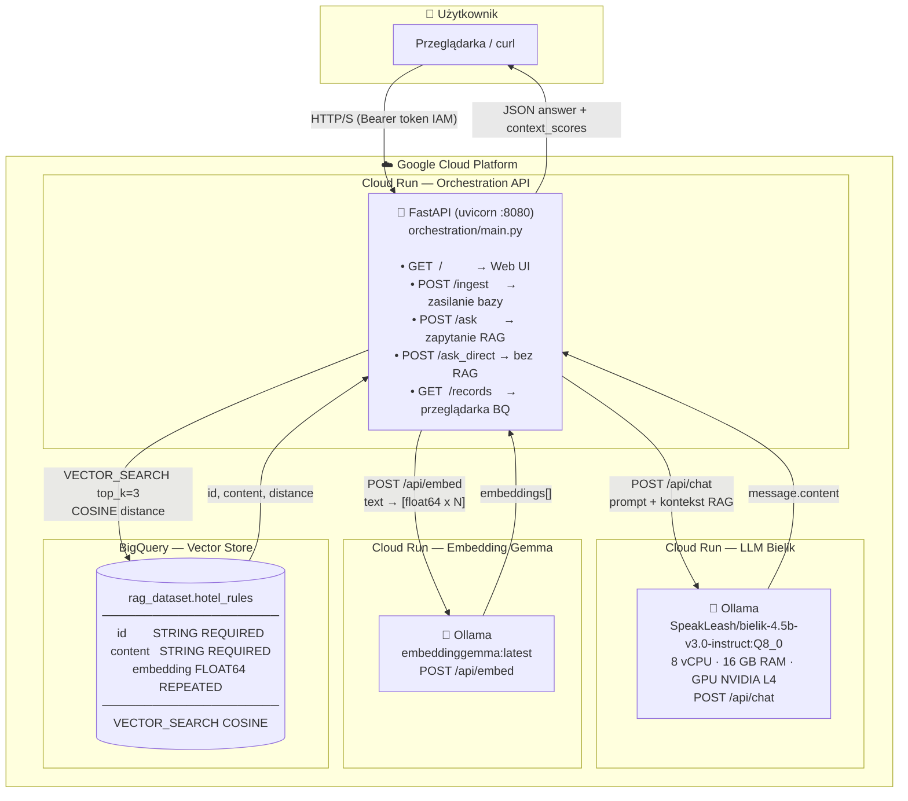

# Architektura — Widok systemowy

Pełna mapa komponentów systemu RAG "Eskadra Bielik Misja 2" wdrożonego w Google Cloud Platform.

## Kluczowe właściwości architektury

| Właściwość | Wartość |
|---|---|
| Typ architektury | Serverless (bezserwerowa) |
| Platforma | Google Cloud Platform |
| Punkt wejścia użytkownika | Orchestration API (Cloud Run) |
| Model LLM | SpeakLeash/bielik-4.5b-v3.0-instruct:Q8_0 |
| Model Embedding | embeddinggemma:latest |
| Baza wektorów | BigQuery Vector Search (COSINE) |
| Liczba dokumentów kontekstu (top_k) | 3 |
| Uwierzytelnianie między serwisami | Google IAM Bearer token |
| Izolacja modeli | `--no-allow-unauthenticated` na Cloud Run |
