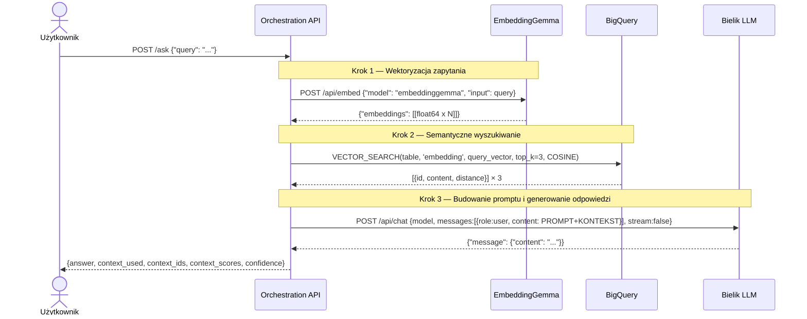

# Architektura — Pipeline RAG (`/ask`)

Przepływ danych dla głównego endpointu RAG — od zapytania użytkownika do odpowiedzi modelu.



## Struktura odpowiedzi `/ask`

```json
{
  "answer": "Odpowiedź modelu Bielik w języku naturalnym",
  "context_used": ["fragment dokumentu 1", "fragment dokumentu 2", "fragment dokumentu 3"],
  "context_ids": ["id1", "id2", "id3"],
  "context_scores": [92.3, 87.1, 81.5],
  "confidence": 87.0
}
```

## Obliczanie wskaźnika trafności (confidence)

Metryka jakości odpowiedzi RAG oparta na odległości cosinusowej:

```
confidence = avg( (1 - cosine_distance) × 100% )
```

| Odległość COSINE | Znaczenie | Confidence |
|---|---|---|
| 0.0 | Identyczne znaczenie | 100% |
| 0.1 | Bardzo zbliżone | 90% |
| 0.5 | Umiarkowane podobieństwo | 50% |
| 1.0 | Brak podobieństwa | 0% |

## Struktura promptu wysyłanego do Bielika

```
Jesteś pomocnym asystentem odpowiadającym na pytania dotyczące zasad hotelowych.
Odpowiedz na poniższe pytanie bazując TYLKO na dostarczonym kontekście.

KONTEKST:
<fragment 1>

<fragment 2>

<fragment 3>

PYTANIE:
<zapytanie użytkownika>
```
