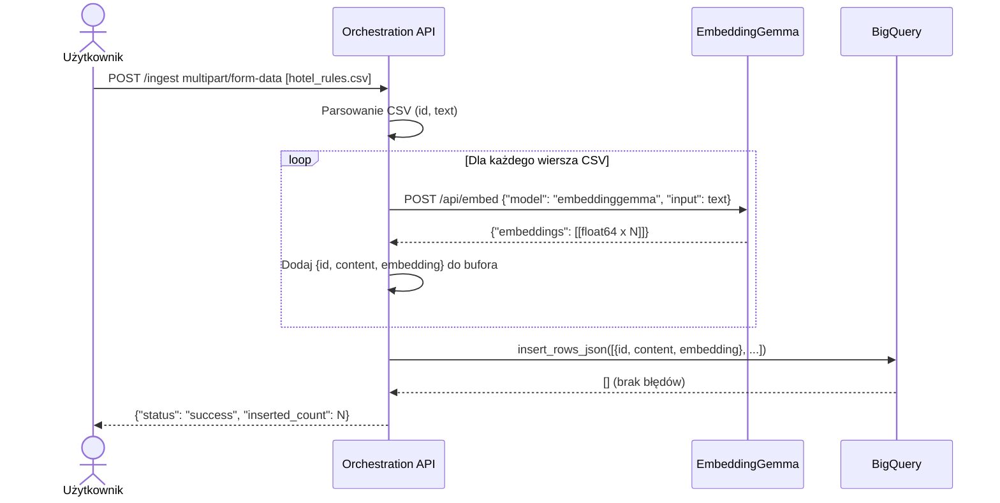

# Architektura — Pipeline Ingestion (`/ingest`)

Przepływ danych dla endpointu zasilania bazy — od pliku CSV do wektorów w BigQuery.



## Schemat tabeli BigQuery

```sql
CREATE TABLE rag_dataset.hotel_rules (
  id        STRING   NOT NULL,
  content   STRING   NOT NULL,
  embedding FLOAT64  REPEATED    -- wektor osadzenia (lista liczb)
);
```

## Format wejściowy CSV

Plik CSV musi zawierać dwie kolumny:

| Kolumna | Typ | Opis |
|---|---|---|
| `id` | string | Unikalny identyfikator dokumentu |
| `text` | string | Treść dokumentu w języku naturalnym |

Po załadowaniu Orchestration API automatycznie dodaje kolumnę `embedding` — wygenerowany wektor liczbowy reprezentujący semantyczne znaczenie tekstu.

## Weryfikacja załadowanych danych — SQL

```sql
-- Liczba rekordów i wymiarowość wektorów
SELECT
  COUNT(*) AS total_records,
  ARRAY_LENGTH(embedding) AS embedding_dimensions
FROM `rag_dataset.hotel_rules`
GROUP BY embedding_dimensions;
```
