# Architektura — Kroki warsztatu i kolejność budowania systemu

Każdy krok warsztatu realizuje konkretny element architektury. Diagram pokazuje kolejność wdrożenia i zależności między komponentami.

```mermaid
graph LR
    S0["🎯 Krok 0\nWstęp\n─────\nArchitektura RAG\nBielik + GCP\n+0 pkt"]
    S1["☁️ Krok 1\nProjekt GCP\n─────\nKonto + kredyty\nNowy projekt\nCloud Shell\n+5 pkt"]
    S2["⚙️ Krok 2\nEnv + Usługi\n─────\nsetup_env.sh\ngcloud services\nIAM run.invoker\n+10 pkt"]
    S3["🦙 Krok 3\nModele na CR\n─────\nBielik LLM\nEmbeddingGemma\nOllama + Docker\n+20 pkt"]
    S4["🗄️ Krok 4\nBigQuery\n─────\ninit_db.py\nrag_dataset\nhotel_rules\n+5 pkt"]
    S5["🔌 Krok 5\nOrchestration\n─────\nFastAPI deploy\norchestration-api\nCloud Run\n+10 pkt"]
    S6["🧪 Krok 6\nTestowanie API\n─────\n/ingest CSV\n/ask RAG\ncurl + BQ\n+10 pkt"]
    S7["📖 Krok 7\nReview kodu\n─────\nEndpointy API\nPrzepływ danych\n+5 pkt"]
    S8["🖥️ Krok 8\nWeb UI\n─────\nRAG vs bez RAG\nEksperyment\n+10 pkt"]
    S9["🏆 Krok 9\nCertyfikat\n─────\ndecode_artifact.py\n75 pkt max"]

    S0-->S1-->S2-->S3-->S4-->S5-->S6-->S7-->S8-->S9

    style S3 fill:#ff9900,color:#000
    style S5 fill:#4285f4,color:#fff
    style S9 fill:#34a853,color:#fff
```



## Co realizuje każdy krok

| Krok | Komponent architektury | Pkt | Zależności |
|---|---|:---:|---|
| 0 | Wprowadzenie do RAG i architektury | — | — |
| 1 | Fundament GCP: projekt, kredyty, Cloud Shell | 5 | — |
| 2 | Środowisko: zmienne, APIs GCP, IAM | 10 | Krok 1 |
| **3** | **Cloud Run: Bielik LLM + EmbeddingGemma** | **20** | **Krok 2** |
| 4 | BigQuery: dataset `rag_dataset`, tabela `hotel_rules` | 5 | Krok 2 |
| 5 | Cloud Run: Orchestration API (FastAPI) | 10 | Kroki 3, 4 |
| 6 | Testy end-to-end: `/ingest` + `/ask` | 10 | Krok 5 |
| 7 | Code review: endpointy i przepływ danych | 5 | Krok 5 |
| 8 | Web UI: porównanie RAG vs bez RAG | 10 | Krok 6 |
| 9 | Certyfikat ukończenia | — | Kroki 1–8 |
| 10 | Czyszczenie zasobów GCP | — | — |

## Krytyczna ścieżka wdrożenia

```
GCP Project → Env Setup → [Bielik LLM + EmbeddingGemma] → BigQuery → Orchestration API → Testy
```

> Krok 3 (wdrożenie modeli) jest **punktem krytycznym** — wszystkie kolejne komponenty zależą od działających URL-i modeli.
> Dlatego jest najwyżej punktowany (20 pkt) i wykonywany równolegle dla skrócenia czasu oczekiwania.
