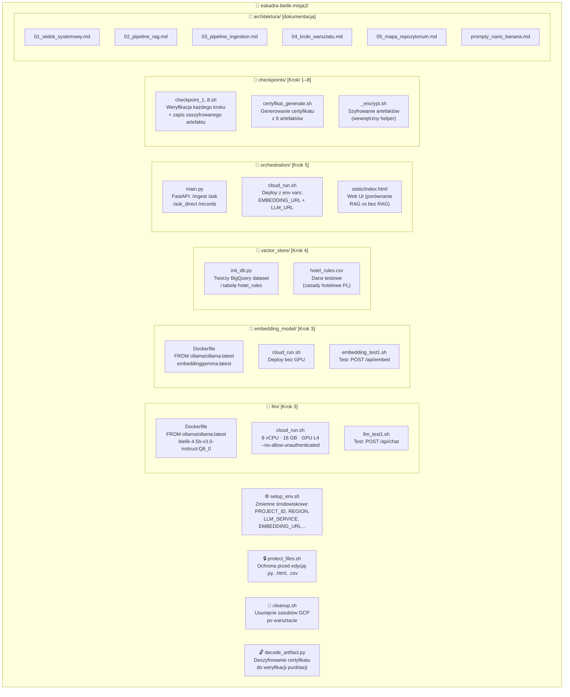

# Architektura — Mapa repozytorium

Struktura plików w repozytorium i ich rola w architekturze.

## Pliki konfiguracyjne środowiska

| Plik | Rola | Kiedy uruchamiać |
|---|---|---|
| `setup_env.sh` | Ustawia zmienne środowiskowe | Na początku każdej sesji terminala (`source`) |
| `protect_files.sh` | Chroni pliki źródłowe przed edycją | Raz, po sklonowaniu repo |
| `cleanup.sh` | Usuwa zasoby GCP | Po zakończeniu warsztatu |

## Pliki Dockerfile — porównanie

| Komponent | Base image | Model | GPU |
|---|---|---|---|
| `llm/Dockerfile` | `ollama/ollama:latest` | `bielik-4.5b-v3.0-instruct:Q8_0` | Tak (L4) |
| `embedding_model/Dockerfile` | `ollama/ollama:latest` | `embeddinggemma:latest` | Nie |
| `orchestration/Dockerfile` | `python:3.11-slim` | — | Nie |

Wszystkie kontenery nasłuchują na porcie `8080` (wymaganie Cloud Run).
